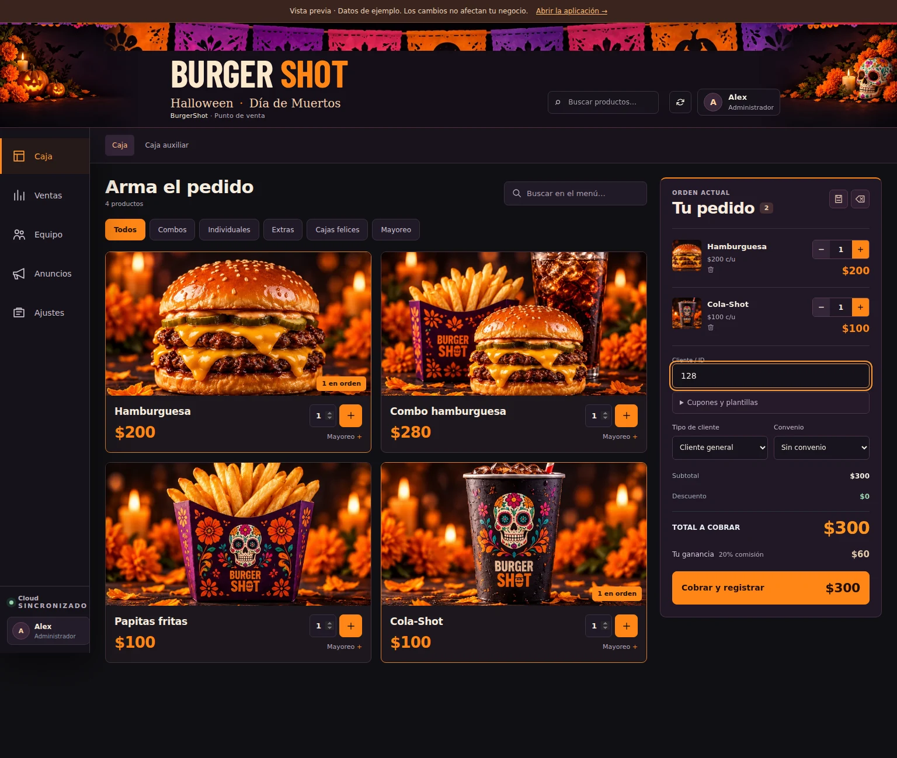

# BurgerShot — Punto de Venta

## V6: Halloween y Día de Muertos

Rediseño basado en la propuesta aprobada: cabecera con papel picado, cempasúchil y calaveritas; catálogo con fotografías de temporada; ticket de cobro separado; navegación por Caja, Ventas, Equipo, Anuncios y Ajustes. Caja es la pantalla inicial. Las secciones secundarias conservan sus permisos.

El cliente se puede escribir en el pedido y pasa a la confirmación de cobro. Cupones, plantillas y cantidades de mayoreo están en controles desplegables. Empleados utiliza un directorio de filas; ventas, reportes, formularios, acceso y caja auxiliar comparten la apariencia de temporada.

**Esta actualización de interfaz no requiere SQL ni volver a desplegar funciones de Supabase.** Se conservan los cálculos, las validaciones del servidor y la conexión existente. Para un despliegue manual, incluye `index.html`, `app.js`, `seasonal.css` y la carpeta `assets/seasonal/`, además de los archivos existentes. No reemplaces tu configuración de conexión. En GitHub Pages se aplicará cuando la rama se integre y el alojamiento publique el commit.

Abre **VISTA_PREVIA.html** para recorrer el diseño con datos de ejemplo. Utiliza un simulador local y muestra una advertencia visible; no conecta con tu Supabase. Sus ventas y cambios solo duran durante esa sesión. `index.html` sigue siendo la aplicación operativa.

Verificación: 18 pruebas de lógica y base de datos, regresión de anuncios/cupones/caja auxiliar, y navegación de las 14 pantallas en 1536, 1024, 768, 390 y 320 px. Se comprobó cliente prellenado, cobro, limpieza del pedido, mayoreo, plantillas, permisos, cierre de sesión, imágenes y ausencia de errores JavaScript. Las pruebas utilizan datos aislados, sin operaciones en la base real.

```bash
npm test
npm run test:ui
npm run test:seasonal
npm run preview:build
```



Si Playwright usa un Chromium del sistema, configura `BURGERSHOT_CHROMIUM` con su ruta. Las instrucciones siguientes documentan versiones anteriores.

## V5.6.1: anuncios listos para copiar y cupones

20 anuncios predefinidos con emojis y botón de copiar, sin ubicación ni horario por rellenar; cupones por porcentaje o importe fijo con vigencia, compra mínima, productos y límite de usos. Disponibles en el POS y la caja auxiliar, con validación y canje atómico en Supabase.

**Si actualizas desde V5.6, no necesitas volver a ejecutar SQL.** Para instalar cupones por primera vez sí debes aplicar la migración incluida antes de publicar los archivos. Sigue [la guía de activación y uso](ANUNCIOS_CUPONES.md). Las instrucciones de versiones anteriores que dicen «no hay migración SQL nueva» corresponden únicamente a esas versiones.

Rework sobre el ZIP completo BurgerShot_V4_4_Professional_Images.zip.

## Corrección V5.0.5

Se corrigieron las tarjetas comprimidas en Todos, Mayoreo y el resto de categorías. Las filas conservan la altura de su contenido y el catálogo se desplaza verticalmente. Las fotografías tienen un espacio reservado que no se reduce al aumentar el número de productos; precios y botones permanecen dentro de cada tarjeta.

Se añadió gestión segura de usuarios desde Administración > Empleados: dar de baja/reactivar conserva el historial y Borrar perfil elimina el acceso solo cuando no existen ventas, cortes, anulaciones, referencias de propietario o cuando no se elimina al último administrador. También se corrigieron las tarjetas comprimidas en Todos, Mayoreo y el resto de categorías.

Los errores de employee-admin ahora muestran el motivo devuelto por Supabase. Si un perfil tiene historial, la pantalla explica que debe darse de baja para conservar sus ventas. Dashboard, Estadísticas y Empleados recibieron una jerarquía visual más clara, métricas más legibles, estados tipo píldora y tarjetas con mejor profundidad. La tabla de Pagos y cortes ahora conserva una escala legible en escritorio y móvil.

Para actualizar desde V5, reemplaza index.html, app.js, styles.css, pos.css, la carpeta assets/ y VISTA_PREVIA.html. Después vuelve a desplegar la función employee-admin incluida en supabase/. No hay migración SQL nueva.

## Actualizar tu app existente

1. Descomprime el proyecto.
2. Reemplaza index.html, app.js y styles.css. Añade pos.css y la carpeta assets/ completa en tu alojamiento actual, respetando la estructura.
3. Conserva tu config.js si ya contiene la URL y la clave pública de Supabase. El archivo recibido para este rework estaba vacío y el incluido sigue vacío.
4. Si configuraste la conexión desde la pantalla de la app, permanece guardada en ese navegador y dominio, usando la misma clave bs_v3_cloud. Si cambias de navegador o dominio, vuelve a introducirla.
5. Recarga con Ctrl + F5.

**No recrees la tienda ni los empleados al actualizar.** La nueva acción de borrado vive en employee-admin y requiere redeploy de esa función.

Si aún no habías habilitado el borrado de órdenes, ejecuta una vez supabase_patch_v4_2.sql en el SQL Editor. Los patches V4.1 y V4.2 son alternativas para el mismo permiso: no necesitas ejecutar ambos. Se corrigió la cláusula duplicada del archivo V4.1 original.

## Nuevo Punto de Venta

- 12 imágenes con aspecto de fotografía comercial: cuatro individuales, cuatro combos, bebida, papitas, helado y caja feliz.
- 24 WebP optimizados: catálogo de 720 px y miniaturas de 160 px; aproximadamente 1 MB en total.
- Cajas EMS/Policía con etiquetas diferenciadas; mayoreo con la cantidad del paquete. La fotografía de mayoreo representa el producto, no todas las unidades del paquete.
- Catálogo con categorías, búsqueda, cantidades añadidas y precios destacados.
- Orden actual con miniatura, nombre, precio unitario, controles −/+, subtotal por producto, eliminación individual y vaciado.
- Convenio, tipo de cliente, total y comisión reunidos junto al botón de cobro.
- Acceso rápido del inicio agrega el producto y abre el POS.
- Protección frente a doble clic, errores al guardar y cambios de precio mientras está abierto el resumen de cobro.
- Reglas de presentación para escritorio, tablet y móvil.

En Administración > Productos > Imagen del producto puedes seleccionar una foto. La opción Automática usa el nombre y la categoría. Los productos existentes no requieren editarse. La selección se guarda como una clave photo:... dentro del campo de texto emoji ya existente; no se añaden columnas. Los valores heredados siguen siendo compatibles.

## Funciones conservadas

Supabase Auth, administrador inicial, acceso de empleados, roles, activación y baja/reactivación, borrado protegido de perfiles, restablecimiento de contraseña mediante Edge Function, comisiones individuales e históricas, convenios y exclusiones, restricciones EMS/Policía, ventas con cliente/nota/método de pago, historial personal/general, exportación CSV, estadísticas, pagos/cortes y Realtime.

Se conservan la anulación y el borrado de órdenes por administrador, incluida la protección que impide borrar una orden ya incluida en un pago. El esquema, employee-admin, config.js y el patch V4.2 son idénticos a los originales recibidos.

## Revisar el diseño sin Supabase

Abre VISTA_PREVIA.html. Es una vista estática del HTML y CSS reales, con datos de ejemplo; sus botones no operan. Para registrar ventas y trabajar usa index.html con tu conexión habitual.

## Instalar desde cero

1. Ejecuta supabase_schema_v3.sql y después supabase_patch_v4_2.sql en Supabase > SQL Editor.
2. Con Supabase CLI configurada, despliega la función incluida:

```bash
supabase login
supabase link --project-ref TU_PROJECT_REF
supabase functions deploy employee-admin
```

3. Publica la carpeta como web estática en tu alojamiento o GitHub Pages. La app no necesita compilación ni npm. Incluye assets/ y pos.css.
4. Configura Project URL y publishable/anon key desde la app o config.js. No uses la service role en el navegador.
5. Pulsa Crear administrador inicial y usa un correo real. Si se solicita confirmación por correo, complétala y vuelve a iniciar sesión para terminar de crear la tienda.
6. Crea empleados y asigna sus comisiones en Administración > Empleados.

La Edge Function utiliza las variables de Supabase del entorno del servidor; la service role no se incorpora al frontend. Para actualizar un proyecto existente, ejecuta `supabase functions deploy employee-admin` después de enlazar tu proyecto.

Para trabajar localmente, si tienes Python 3 instalado:

```bash
python -m http.server 8000 --bind 127.0.0.1
```

Abre http://localhost:8000 en tu navegador. Opera la app mediante HTTP/HTTPS; la vista previa estática puede abrirse directamente como archivo.

## Verificación y alcance

Consulta VERIFICACION.md. Se probaron 28 escenarios con datos simulados. El ZIP recibido no incluía configuración de acceso a Supabase: no se realizaron operaciones sobre tu base real.

La comprobación visual en navegador quedó bloqueada en el entorno de entrega. Se incluye VISTA_PREVIA.html para revisar el resultado. La app operativa utiliza Supabase y no carga el simulador de pruebas.
